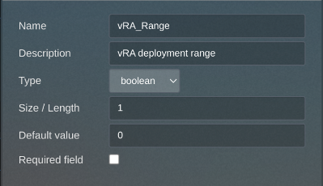
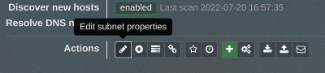

# Custom Fields in phpIPAM
In environments with a large number of monitored subnets, it may be desirable to only tell vRA about those which will actually be used for deployments. This can be accomplished by applying a Custom Field to the selected subnets, and configuring the IPAM integration to filter on that field.

In my environments, I have defined a boolean named `vRA_Range`, though you can of course use whatever name sounds good to you.

## Create a Custom Field
1. Log in to your phpIPAM instance and navigate to **Administration -> IP Related Management -> Custom fields**.
2. Click on the **+** button under the *Custom Subnets fields* section.
3. Populate the fields as you see fit. Here's how I configured mine:

    

    | Parameter | Value |
    |:--- |:--- |
    | Name | `vRA_Range` |
    | Description | `vRA deployment range` |
    | Type | `boolean` |
    | Size/Length | `1` |
    | Default value | `0` |
    | Required field | (unchecked) |

4. Click **Add**.

## Apply a Custom Field to a Subnet
1. Navigate to a subnet you'd like to use for vRA deployments.
2. On the *Actions* row, click the pencil icon to edit the subnet.
    
    
3. At the bottom of the properties window, select **VRA_Range** and set it to *Yes*.

    
4. Click **Edit** to save the change.
5. Repeat for other vRA subnets.

## Configure integration

1. When you configure this integration in vRA, tick the *Subnets must match filter* box.
2. Enter the name of your Custom Field, *prefixed with `custom_` (ex: `custom_vRA_Range`).
3. Enter the value to match on (`1`=="Yes"; `0`=="No").